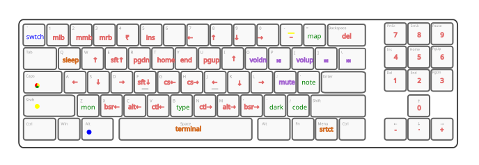

# Caps

Caps - AHK

Helps you navigate and edit text faster on a physical keyboard with shortcuts like: <kbd>Caps</kbd> + <kbd>Y</kbd> : <kbd>Home</kbd> - i.e. cursor to beginning of the line.
Also <kbd>W</kbd><kbd>S</kbd><kbd>A</kbd><kbd>D</kbd> and <kbd>I</kbd><kbd>K</kbd><kbd>J</kbd><kbd>L</kbd> to <kbd>↑</kbd><kbd>↓</kbd><kbd>←</kbd><kbd>→</kbd> direction keys — twin arrow clusters for either hand.

The main goal is to Not have to lift the hands from their default type resting position - i.e. index fingers on the <kbd>F</kbd> & <kbd>J</kbd> keys.

Built using: [AutoHotkey](https://www.autohotkey.com)

##### NOTE :

Normal <kbd>Caps</kbd> lock functionality will stop working once the program begins.
Double tap the <kbd>Caps</kbd> key for normal caps lock operation.

In case if you ever need to disable `caps` functionality you may suspend the program from the notification area (`Caps Keyboard icon` > `Right Click` > `Suspend Hotkeys`)

## Shortcuts

    

| Serial | Key                  | Shift         | Primary                                           | Modifier         | Secondary  |
| ------ | -------------------- | ------------  | ------------------------------------------------- | ---------------- | ---------- |
| 1      | <kbd>Q</kbd>         |               | SLEEP                                             |                  |            |
| 2      | <kbd>W</kbd>         |               | <kbd>↑</kbd>                                      |                  |            |
| 3      | <kbd>E</kbd>         |               | <kbd>Shift</kbd> + <kbd>↑</kbd>                   |                  |            |
| 4      | <kbd>R</kbd>         |               | <kbd>Page Down</kbd>                              |                  |            |
| 5      | <kbd>T</kbd>         |               | <kbd>Home</kbd>                                   |                  |            |
| 6      | <kbd>Y</kbd>         |               | <kbd>End</kbd>                                    |                  |            |
| 7      | <kbd>U</kbd>         |               | <kbd>Page Up</kbd>                                |                  |            |
| 8      | <kbd>I</kbd>         |               | <kbd>↑</kbd>                                      |                  |            |
| 9      | <kbd>O</kbd>         |               | Volume Down                                       |                  |            |
| 10     | <kbd>P</kbd>         |               | <kbd>⏯️</kbd>                                     |                  |            |
| 11     | <kbd>[</kbd>         | <kbd>{</kbd>  | Volume Up                                         |                  |            |
| 12     | <kbd>]</kbd>         | <kbd>}</kbd>  | ⏮️                                                |                  |            |
| 13     | <kbd>\\</kbd>        | <kbd>\|</kbd> | ⏭️                                                |                  |            |
| 14     | <kbd>A</kbd>         |               | <kbd>←</kbd>                                      |                  |            |
| 15     | <kbd>S</kbd>         |               | <kbd>↓</kbd>                                      |                  |            |
| 16     | <kbd>D</kbd>         |               | <kbd>→</kbd>                                      |                  |            |
| 17     | <kbd>F</kbd>         |               | <kbd>Shift</kbd> + <kbd>↓</kbd>                   |                  |            |
| 18     | <kbd>G</kbd>         |               | <kbd>Ctrl</kbd> + <kbd>Shift</kbd> + <kbd>←</kbd> |                  |            |
| 19     | <kbd>H</kbd>         |               | <kbd>Ctrl</kbd> + <kbd>Shift</kbd> + <kbd>→</kbd> |                  |            |
| 20     | <kbd>J</kbd>         |               | <kbd>←</kbd>                                      |                  |            |
| 21     | <kbd>K</kbd>         |               | <kbd>↓</kbd>                                      |                  |            |
| 22     | <kbd>L</kbd>         |               | <kbd>→</kbd>                                      |                  |            |
| 23     | <kbd>;</kbd>         | <kbd>:</kbd>  | <kbd>Volume Mute</kbd>                            |                  |            |
| 24     | <kbd>'</kbd>         | <kbd>"</kbd>  | Open Notepad                                      |                  |            |
| 25     | <kbd>Enter</kbd>     |               |                                                   |                  |            |
| 26     | <kbd>Z</kbd>         |               | Turn off MONITOR                                  |                  |            |
| 27     | <kbd>X</kbd>         |               | <kbd>Browser ←</kbd>                              |                  |            |
| 28     | <kbd>C</kbd>         |               | <kbd>Alt</kbd> + <kbd>←</kbd>                     |                  |            |
| 29     | <kbd>V</kbd>         |               | <kbd>Ctrl</kbd> + <kbd>←</kbd>                    |                  |            |
| 30     | <kbd>B</kbd>         |               | paste type                                        | <kbd>space</kbd> | end wait   |
| 31     | <kbd>N</kbd>         |               | <kbd>Ctrl</kbd> + <kbd>→</kbd>                    |                  |            |
| 32     | <kbd>M</kbd>         |               | <kbd>Alt</kbd> + <kbd>→</kbd>                     |                  |            |
| 33     | <kbd>,</kbd>         | <kbd><</kbd>  | <kbd>Browser →</kbd>                              |                  |            |
| 34     | <kbd>.</kbd>         | <kbd>></kbd>  | Toggle DARK MODE                                  |                  |            |
| 35     | <kbd>/</kbd>         | <kbd>?</kbd>  | Open Code editor                                  |                  |            |
| 36     | <kbd>Shift</kbd>     |               |                                                   |                  |            |
| 37     | <kbd>`</kbd>         | <kbd>~</kbd>  |                                                   |                  |            |
| 38     | <kbd>1</kbd>         | <kbd>!</kbd>  | <kbd>Mouse Left button</kbd>                      |                  |            |
| 39     | <kbd>2</kbd>         | <kbd>@</kbd>  | <kbd>Mouse Middle button</kbd>                    |                  |            |
| 40     | <kbd>3</kbd>         | <kbd>#</kbd>  | <kbd>Mouse Right button</kbd>                     |                  |            |
| 41     | <kbd>4</kbd>         | <kbd>₹</kbd>  | <kbd>₹</kbd>                                      |                  |            |
| 42     | <kbd>5</kbd>         | <kbd>%</kbd>  | <kbd>Insert</kbd>                                 |                  |            |
| 43     | <kbd>6</kbd>         | <kbd>^</kbd>  |                                                   |                  |            |
| 44     | <kbd>7</kbd>         | <kbd>&</kbd>  |                                                   |                  |            |
| 45     | <kbd>8</kbd>         | <kbd>*</kbd>  |                                                   |                  |            |
| 46     | <kbd>9</kbd>         | <kbd>(</kbd>  |                                                   |                  |            |
| 47     | <kbd>0</kbd>         | <kbd>)</kbd>  |                                                   |                  |            |
| 48     | <kbd>-</kbd>         | <kbd>_</kbd>  | <kbd>–</kbd>                                      | <kbd>Shift</kbd> | <kbd>—</kbd> |
| 49     | <kbd>=</kbd>         | <kbd>+</kbd>  | Open keyboard map                                 |                  |            |
| 50     | <kbd>Backspace</kbd> | <kbd>Delete</kbd> |                                               | <kbd>Ctrl</kbd>  | whole word |
| 51     | <kbd>Space</kbd>     |               | TERMINAL : active path                            |                  |            |
| 52     | <kbd>Prtsc</kbd>     |               | <kbd>7</kbd>                                      |                  |            |
| 53     | <kbd>Scrlk</kbd>     |               | <kbd>8</kbd>                                      |                  |            |
| 54     | <kbd>Pause</kbd>     |               | <kbd>9</kbd>                                      |                  |            |
| 55     | <kbd>Del</kbd>       |               | <kbd>1</kbd>                                      |                  |            |
| 56     | <kbd>Home</kbd>      |               | <kbd>5</kbd>                                      |                  |            |
| 57     | <kbd>End</kbd>       |               | <kbd>2</kbd>                                      |                  |            |
| 58     | <kbd>Pg Up</kbd>     |               | <kbd>6</kbd>                                      |                  |            |
| 59     | <kbd>Pg Dn</kbd>     |               | <kbd>3</kbd>                                      |                  |            |
| 60     | <kbd>Ins</kbd>       |               | <kbd>4</kbd>                                      |                  |            |
| 61     | <kbd>↑</kbd>         |               | <kbd>0</kbd>                                      |                  |            |
| 62     | <kbd>↓</kbd>         |               | <kbd>.</kbd>                                      |                  |            |
| 63     | <kbd>←</kbd>         |               | <kbd>-</kbd>                                      |                  |            |
| 64     | <kbd>→</kbd>         |               | <kbd>+</kbd>                                      |                  |            |
| 65     | <kbd>Menu</kbd>      |               | APP SHORTCUT menu                                 |                  |            |

[ #53 - #61 : optimized for Ten Keyless (TKL) keyboards ]

#### In combination with the <kbd>Alt</kbd> key

| Serial       | Key         | Action              |
|--------------|-------------|---------------------|
| 66     |<kbd>`</kbd> |SWITCH WINDOW sameapp|

#### Direct (without combination)

| Serial | Key              | Action      |
|--------|------------------|-------------|
| 67     | <kbd>Prtsc</kbd> | Volume Mute |
| 68     | <kbd>Scrlk</kbd> | Volume Down |
| 69     | <kbd>Pause</kbd> | Volume Up   |

## Config

`right_click_left` : maps right click to left click

## Supported platforms

`Windows`

## Additional repo depedency

[github : FuPeiJiang/VD.ahk](https://github.com/FuPeiJiang/VD.ahk/tree/v2_port)
Place in root

## Author

[Ujjwal Singh — avyaan.tech](https://avyaan.tech)

## Todo

MacOS support likely using: [hammerspoon](https://www.hammerspoon.org)
